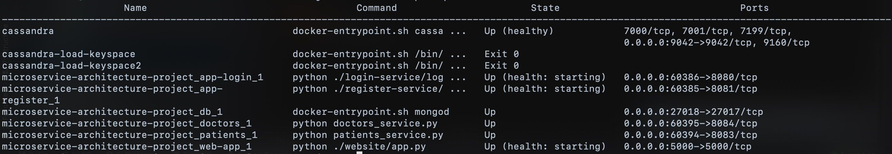

# Microservice-Architecture-Project: Hospital info search
The final project of Software Architecture course. 

This hospital search system is meant for medical specialists to access data 
about patients and doctors from the hospital easily.

## Instructions
```
docker-compose build && docker-compose up
```

Scale to multiple services:
```
docker-compose scale app-register=2 app-login=2 patients=2 doctors=2
```

Now connect to [http://0.0.0.0:5000](http://0.0.0.0:5000). Here You can register,
login, search for patients and doctors by name and surname or by id, and afterwards log out.

Situation according to ```docker-compose ps```:


Finish and clean up:
```
docker-compose down
```

## Project architecture

## Authors
* [Oleksandra Hutor](https://github.com/Oleksandra2020)
* [Natalie Romanyshyn](https://github.com/romanyshyn-natalia)
* [Anna Korabliova](https://github.com/anika02)
* [Daria Omelkina](https://github.com/dariaomelkina)
